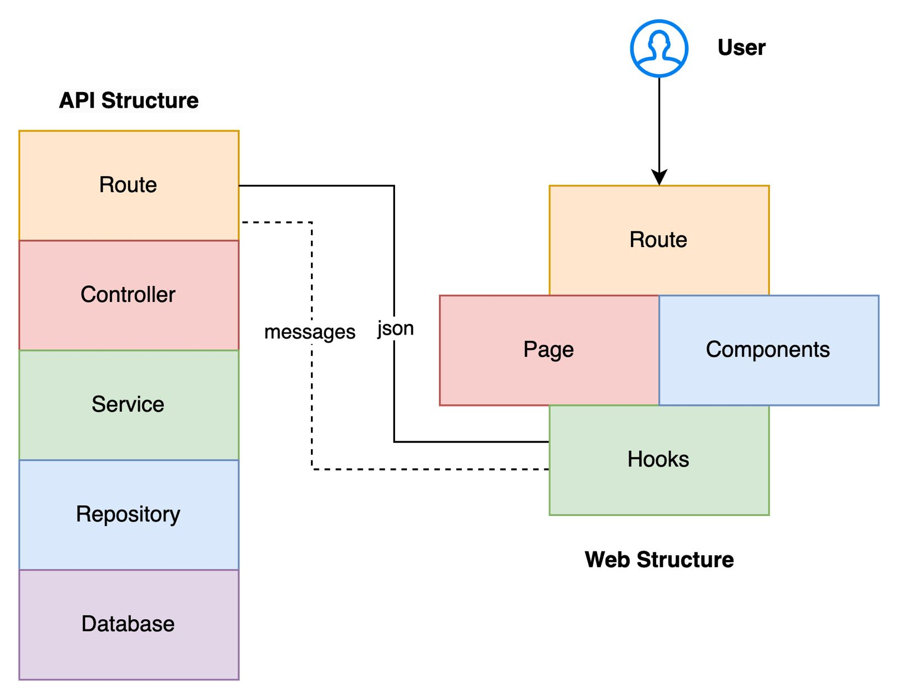

# 💬 MyChaty

A simple web chat application


## 🚀 Features 
### User Authentication
- [x]  Secure user login and registration (Email and Password)

### Real-Time Messaging
- [x]  Instant messaging with real-time updates

### Manage User Friends
- [x]  List user friends
- [x]  Remove user friends

### User Invites
- [x]  Send chating invites for others users
- [x]  Accept invites sent for you
- [x]  Deny invites sent for you

### Real-Time Notications
- [x] Message notification
- [ ] Receive invite notification
- [ ] Invite accepted notification

## 🏛️ Architecture



## 🛠️ Tech Stack
### Web
- [React](https://reactjs.org/)
- [Shadcn/UI](https://github.com/shadcn/ui)
- [TailwindCSS](https://tailwindcss.com/)

### API
- [NodeJs](https://nodejs.org/)
- [Fastify](https://www.fastify.io/)
- [PostgreSQL](https://www.postgresql.org/)
- [Docker](https://www.docker.com/)
- [Socket.io](https://socket.io/)

## 📦 Dependencies
- [Node/NPM](https://nodejs.org/)
- [Docker](https://www.docker.com/)

## 🏃‍♂️ Running Guide (development environment)
### Web
1. Change to web directory
```bash
cd web
```

2. Installing Packages
```bash
npm install
```

3. Run project
```bash
npm run dev
```
✅ Web project will be available at: [http://localhost:5173](http://localhost:5173)

### API
1. Change to api directory
```bash
cd api
```

2. Installing Packages
```bash
npm install
```

3. Start PSQL using docker
```bash
docker compose up -d
```

4. Run project
```bash
npm run dev
```

5. Database Vizualization (optional)
```bash
npx prisma studio
```

✅ API will be available at: [http://localhost:3000](http://localhost:3000)

## 🐛 Reporting Issues or Suggesting Enhancements

If you’ve found a bug or have a suggestion to improve MyChaty, we’d love to hear from you! Please follow the steps below to create a new issue:

1. **Check existing issues**: Before creating a new issue, please check if someone has already reported the same problem or suggested something similar. This helps avoid duplicates and fosters better collaboration.

2. **Create a new issue**:
    - Go to the [Issues](https://github.com/arthurmousinho/mychaty/issues) tab of the repository.
    - Click the **New issue** button.
    - Choose the lable of issue: **bug**, **enhancement**, **API**, **WEB** or other.
    - Include steps to reproduce the bug, details about the environment where it occurred, or a clear description of the suggestion.

3. **Issue details**:
    - For bugs: Provide a clear description of the problem, steps to reproduce, expected results, and observed results.
    - For suggestions: Describe the desired functionality, how it would benefit users, and, if possible, an idea of how to implement it.

4. **Follow your issue**: After creating the issue, keep an eye on it to see if anyone from the team or other contributors have added comments or questions. Be available to provide more information if needed.

5. **Contribute to the solution**: If you are willing and able, feel free to work on the solution and submit a Pull Request related to your issue.


## 💬 Contribution
We welcome contributions to MyChaty! Please follow these steps:
1. Fork the repository.
2. Create a feature branch (`git checkout -b feature/your-feature-name`).
3. Commit your changes (`git commit -am 'Add new feature'`).
4. Push to the branch (`git push origin feature/your-feature-name`).
5. Open a pull request.

## 📜 License
This project is licensed under the MIT License. See the [LICENSE](LICENSE) file for details.